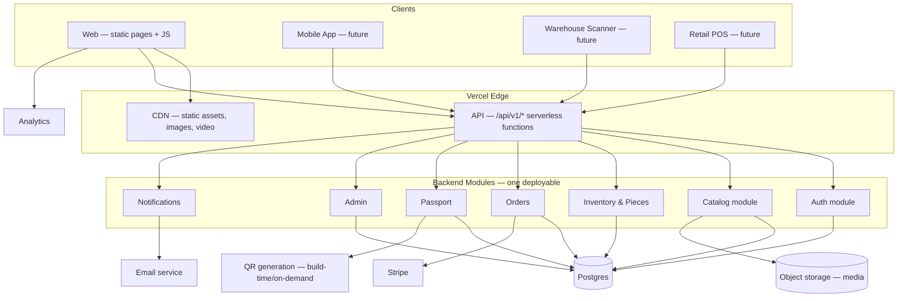
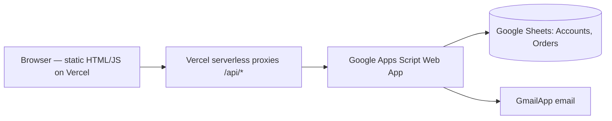
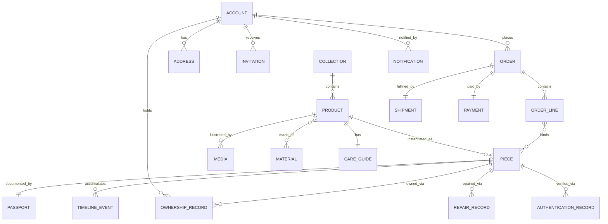
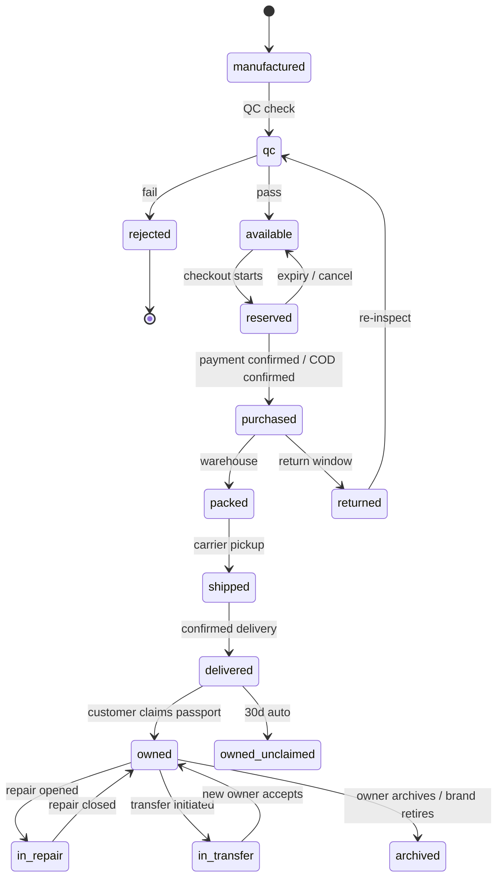
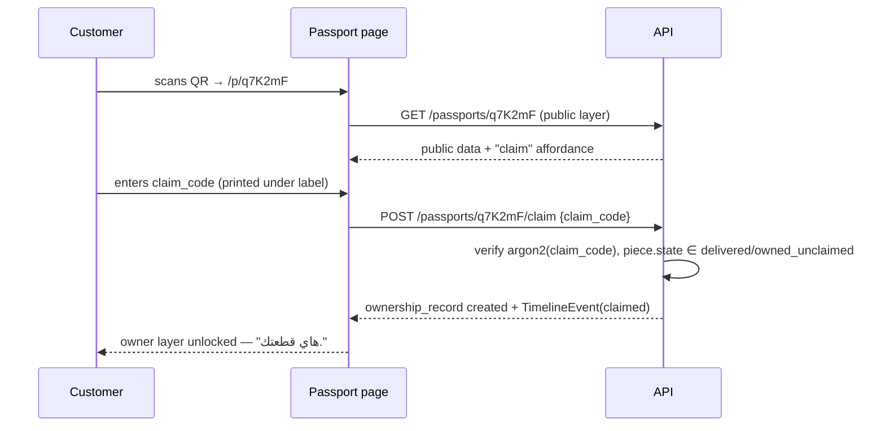
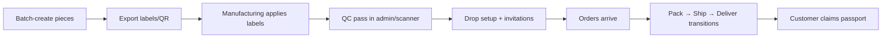
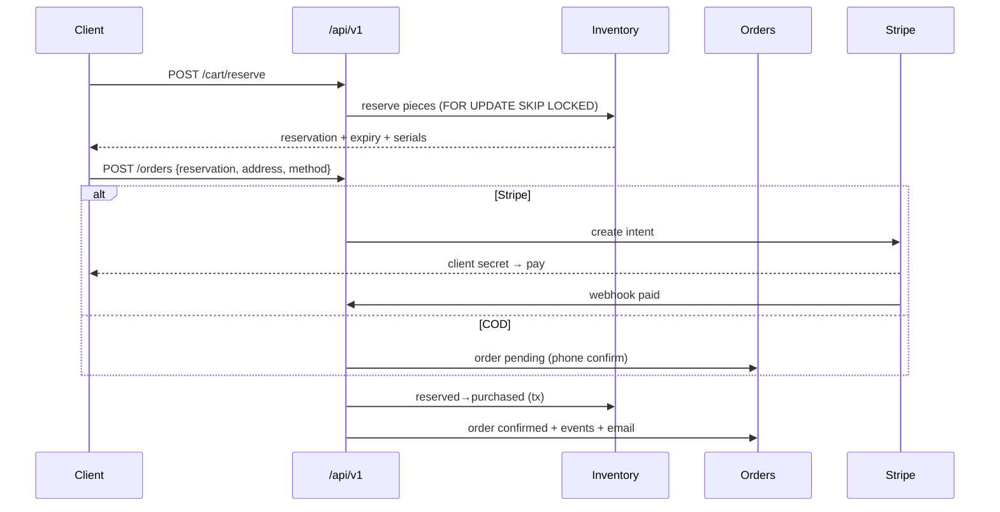

# DIRBALK — Software Architecture Document (SAD)

**Version:** 1.0
**Date:** 2026-07-18
**Status:** Living document — every new architectural decision MUST be appended to §21 (Decision Log) with date and rationale.
**Audience:** Any engineer joining the project. This document should be sufficient to build the platform without additional context.

---

## 1. Executive Summary

DIRBALK (دير بالك) is a Jordanian streetwear brand built on a philosophy of clean exteriors and hidden depth. The platform is not a generic e-commerce site: it is a **piece-centric commerce and ownership system** where every physical garment has a digital identity that lives as long as the garment does.

**Business goals:** sell small-run collections through an invitation-based drop model; build a brand whose digital experience matches the physical product's obsessive detail; own the customer relationship end-to-end (registration → invitation → purchase → ownership → resale).

**Technical goals:** a modular, API-first architecture where the *piece* (an individual physical garment, not the product model) is the atomic unit. Everything — inventory, orders, passports, QR codes, repairs, resale — hangs off the piece.

**Long-term vision (5–10 years):** the same core data model powers the website, a mobile app, warehouse scanners, retail POS, a repair portal, and a resale authentication service, without re-architecture. A DIRBALK jacket bought in 2026 should be scannable, verifiable, and transferable in 2033.

**Current reality (honest):** today the system is static HTML on Vercel + Google Apps Script + Google Sheets. This SAD defines the target architecture *and* the migration path. We do not pretend the current stack is the destination (see §19).

---

## 2. Product Vision

### What DIRBALK is
A brand whose name comes from a phrase people say to someone they care about. The exterior of every garment is completely clean; the identity lives in hidden details. The digital platform mirrors this: quiet surfaces, depth for whoever looks.

### What makes it different from normal e-commerce
| Normal e-commerce | DIRBALK |
|---|---|
| Sells SKUs (product × size) | Sells **pieces** — individually numbered physical garments |
| Inventory is a counter | Inventory is a set of piece records, each with its own lifecycle |
| Relationship ends at delivery | Relationship begins at delivery (passport, care, repair, transfer) |
| Open store | Invitation-gated drops; registration does not guarantee access |
| Marketing explains everything | Deliberate mystique; the platform never explains the hidden details |

### The ownership experience
When a customer receives a piece, a QR on the packaging/label leads to that piece's **Digital Passport**: proof of authenticity, its number in the run, materials, care, and — once claimed — a private timeline (purchase, repairs, transfers). Owning a DIRBALK piece means holding both the garment and its record.

### Philosophy of Piece IDs and Passports
- Every piece is numbered (e.g., piece 043 of 100). Numbering is a fact, not a marketing label — the brand deliberately does **not** use "limited edition" language.
- The passport is the garment's biography. It must remain useful even if DIRBALK's website changes completely — hence stable URLs and an export path.
- The passport never explains the brand's hidden meanings. It confirms; it does not narrate.

---

## 3. Core Principles

1. **Piece-centric.** The individual garment is the atomic entity. Products describe; pieces exist.
2. **API-first.** Every capability is an API before it is a screen. The website is just the first client.
3. **Modular monolith, not microservices.** One deployable backend with strict internal module boundaries (accounts, catalog, inventory, orders, passport, admin). Microservices at this scale are a self-inflicted wound; module boundaries give us the future split option for free.
4. **Boring technology.** Postgres, REST, server-rendered or static pages. Innovation budget is spent on the passport/piece system, not on infrastructure novelty.
5. **Stable identifiers forever.** Piece codes, passport URLs, and order IDs are immutable once issued. A QR printed on 300 labels cannot be re-printed.
6. **Security appropriate to what's at stake.** Real authentication for real access; theatrical gates only where explicitly accepted as theater (documented in §15).
7. **Premium UX floor.** RTL-first, gendered Arabic, dark visual system, sharp corners, Arial + Cairo Bold for the brand phrase only, minimal motion with intent, mobile-first.
8. **Privacy by default.** Public passport pages expose zero PII. Ownership data is owner-visible only.
9. **Migration over rewrite.** Each phase must run in production while the next is built. No big-bang cutovers.
10. **One source of truth.** This document. Conflicts between code and SAD are bugs in one of them.

---

## 4. User Roles

| Role | Description | Permissions (summary) |
|---|---|---|
| **Guest** | Unauthenticated visitor | View public pages (home/waitlist, about, privacy, public passport layer). Register on waitlist. |
| **Customer** | Registered person | Everything Guest can; enter shop when invited/open; purchase; view own orders; claim pieces; view/manage owned passports; initiate transfers; request repairs. |
| **Admin (Owner)** | Fadel / brand principals | Full access: catalog, pieces, inventory, orders, customers, invitations, passports, timeline overrides, settings, permissions. Only role that can void/reissue piece records. |
| **Customer Support** | Future staff | Read customers/orders; update order status; append timeline notes; cannot touch inventory counts, pieces' authenticity fields, or settings. |
| **Warehouse** | Future staff/device | Scan-driven: transition pieces through packed/shipped states; print labels; no access to customer PII beyond shipping fields; no catalog editing. |
| **Manufacturing Manager** | Future | Register manufactured pieces (batch import), QC pass/fail transitions only. |
| **Retail Employee** | Future | POS: sell in-store pieces (available → purchased), look up passports; no online-order access. |
| **Authentication Team** | Future | Read piece + full timeline; append `authenticated` events; flag counterfeits; cannot edit history. |

**Permission model:** role-based (RBAC) with per-module scopes (`catalog:read`, `pieces:transition`, `orders:write`, …). Admin UI renders from the same scopes the API enforces — the API is the boundary, never the UI.

---

## 5. System Overview

### Target architecture (Phase 1+)



**Connections explained:**
- **Clients → CDN:** all static pages, images, and video are cached at the edge. The site stays static-first; dynamic data arrives via API calls.
- **Clients → API:** every read/write of live data. JSON over HTTPS, versioned under `/api/v1`.
- **API → modules:** thin HTTP layer; business logic lives in modules with explicit interfaces (a module never reaches into another's tables directly).
- **Modules → Postgres:** single database, one schema per module namespace. Foreign keys cross namespaces deliberately and are documented in §7.
- **Orders → Stripe:** payment intents; webhooks confirm payment → order state transition. Cash-on-delivery bypasses Stripe with an explicit `payment_method=cod` path (Jordan reality).
- **Notifications → Email service:** transactional mail (invitations, confirmations, resets) through a real ESP (Resend/Postmark) — replaces GmailApp and its ~100/day quota.
- **Passport → QR:** QR encodes only the passport URL. All intelligence is server-side; the QR never contains data that could go stale.

### Current architecture (Phase 0 — running today)



Phase 0 remains authoritative until Phase 1 cutover (§17). The proxy pattern is the seam: proxies will be re-pointed from Apps Script to the real API one endpoint at a time.

---

## 6. Domain Model

### Entities and relationships

- **Account** — a person. May be waitlist-only (no password) or full (credentials). Owns Addresses, places Orders, owns Pieces (via OwnershipRecords), receives Notifications.
- **Collection** — a named release (Collection 01 · Winter 2026). Has many Products. Has drop windows (open/close datetimes).
- **Product** — a design (DB-JAC-01). Belongs to a Collection. Has Materials, a CareGuide, Media, size specs, price. Has many Pieces.
- **Piece** — one physical garment. Belongs to a Product; has size, serial number within its run, current lifecycle state, and exactly one Passport. The heart of the system.
- **Passport** — the public+private digital record of a Piece. 1:1 with Piece. Aggregates TimelineEvents, current OwnershipRecord, authenticity status.
- **TimelineEvent** — an append-only event on a Piece (manufactured, qc_passed, sold, delivered, claimed, repaired, transferred, authenticated…). Never edited, never deleted; corrections are new events.
- **Order** — a purchase. Belongs to an Account (or guest email in edge cases). Has OrderLines; each OrderLine reserves→binds specific Pieces. Has a Shipment, a Payment.
- **Shipment** — carrier, tracking, status, address snapshot.
- **Payment** — method (cod|stripe), amount, status, external refs.
- **Address** — belongs to Account; orders snapshot addresses (immutability of history).
- **Media** — images/videos; attachable to Product, Collection, or Piece (piece-specific photos for authentication).
- **Material** — fabric/hardware definitions (12oz raw indigo, matte-silver buttons) shared across Products.
- **CareGuide** — structured care instructions per Product.
- **Invitation** — a drop-access grant: account, token, window, used/expiry state. (Generalizes today's magic links.)
- **OwnershipRecord** — links Account↔Piece with start/end timestamps; transfers close one record and open the next.
- **RepairRecord** — a repair request/completion tied to a Piece; emits TimelineEvents.
- **AuthenticationRecord** — a verification act on a Piece by the Authentication role; emits TimelineEvents.
- **Notification** — outbound message log (email/WhatsApp/push-future) with template, payload, status.
- **AdminUser / Role / Scope** — staff identities and RBAC.



---

## 7. Database Design (Postgres, target)

Conventions: `uuid` PKs (`gen_random_uuid()`), `created_at/updated_at timestamptz` on every table, soft-delete only where noted (`deleted_at`), snake_case. Money as `integer` minor units? **No — JD has 3 decimals (fils); store `numeric(10,3)` with currency `char(3) default 'JOD'`.**

### accounts
| field | type | notes |
|---|---|---|
| id | uuid PK | |
| email | citext UNIQUE NOT NULL | index |
| name | text NOT NULL | |
| gender | text CHECK IN ('male','female') | drives gendered UX |
| phone | text NULL | E.164 |
| password_hash | text NULL | argon2id; NULL = waitlist-only account |
| email_verified_at | timestamptz NULL | |
| waitlist_position | integer NULL | assigned once, immutable |
| country | text NULL | |
| status | text CHECK IN ('active','blocked') default 'active' | |

Indexes: `(email)`, `(status)`, `(created_at)`.

### addresses
| field | type | notes |
|---|---|---|
| id | uuid PK | |
| account_id | uuid FK→accounts | index |
| label, city, street, details | text | |
| location_link | text NULL | maps URL |
| is_default | boolean | partial unique index `(account_id) WHERE is_default` |

### collections
id PK; code text UNIQUE ('C01'); title text; season text; drop_opens_at / drop_closes_at timestamptz NULL; status ('draft','announced','live','closed').

### products
| field | type | notes |
|---|---|---|
| id | uuid PK | |
| collection_id | uuid FK→collections | index |
| code | text UNIQUE | 'DB-JAC-01' — public, immutable |
| name_ar, name_en | text | |
| story_ar, story_en | text | |
| price | numeric(10,3) | |
| currency | char(3) default 'JOD' | |
| size_specs | jsonb | POM tables (customer-facing subset flagged) |
| status | text ('draft','active','archived') | |

### materials / product_materials
materials: id, code, name_ar/en, composition text, notes. product_materials: (product_id, material_id) PK pair.

### care_guides
id PK; product_id FK UNIQUE; instructions jsonb (ordered list with icons).

### pieces  ← the core table
| field | type | notes |
|---|---|---|
| id | uuid PK | internal only |
| product_id | uuid FK→products | index |
| serial | integer NOT NULL | 1..run_size; UNIQUE(product_id, serial) |
| size | text CHECK IN ('S','M','L') | index with product for stock queries |
| piece_code | text UNIQUE NOT NULL | human/public code, e.g. `DBJ1-M-043` — printed, immutable |
| passport_slug | text UNIQUE NOT NULL | unguessable short code for URL, e.g. `q7K2mF` — printed in QR, immutable |
| claim_code | text NOT NULL | secret under the label; argon2 hash stored, plaintext printed once |
| state | text NOT NULL | see §8 enum; index |
| batch_ref | text NULL | manufacturing batch |
| notes | text | admin only |

Indexes: `(product_id, size, state)` — powers stock; `(state)`; `(passport_slug)`; `(piece_code)`.

### timeline_events (append-only)
| field | type | notes |
|---|---|---|
| id | uuid PK | |
| piece_id | uuid FK→pieces | index, `(piece_id, created_at)` |
| type | text NOT NULL | manufactured, qc_passed, qc_failed, listed, reserved, released, sold, packed, shipped, delivered, claimed, transferred_out, transferred_in, repair_opened, repair_closed, authenticated, flagged, archived, note |
| actor_type | text | 'system','admin','customer','warehouse','auth_team' |
| actor_id | uuid NULL | |
| visibility | text CHECK IN ('public','owner','admin') | passport rendering filter |
| payload | jsonb | event-specific data |

No UPDATE/DELETE grants on this table for the app role. Corrections = compensating events.

### ownership_records
id PK; piece_id FK; account_id FK; started_at; ended_at NULL; acquired_via ('purchase','transfer','admin'); index `(piece_id) WHERE ended_at IS NULL` UNIQUE — at most one current owner.

### orders
| field | type | notes |
|---|---|---|
| id | uuid PK | |
| public_id | text UNIQUE | 'DB-XXXXXXXX' — keep existing format |
| account_id | uuid FK NULL | |
| email, name, phone | text | snapshot |
| status | text | 'pending','confirmed','packed','shipped','delivered','cancelled','returned' |
| subtotal, shipping_fee, total | numeric(10,3) | |
| address_snapshot | jsonb | |

### order_lines
id PK; order_id FK; product_id FK; size; unit_price; qty; index (order_id).

### order_line_pieces
(order_line_id FK, piece_id FK) PK pair — binds sold pieces to lines. UNIQUE(piece_id) among non-cancelled orders enforced in logic + partial index.

### reservations
id PK; piece_id FK UNIQUE-active; account_id/session_ref; expires_at; released_at NULL. Index `(expires_at) WHERE released_at IS NULL` for the sweeper.

### shipments
id PK; order_id FK UNIQUE; carrier; tracking_ref; status; events jsonb.

### payments
id PK; order_id FK UNIQUE; method ('cod','stripe'); status ('pending','paid','failed','refunded'); stripe_payment_intent NULL; amount; paid_at NULL.

### invitations
id PK; account_id FK; token_hash text; drop_ref text; issued_at; expires_at; used_at NULL; channel ('email','whatsapp'); index (account_id), (expires_at).

### media
id PK; kind ('image','video'); url; alt_ar/en; owner_type ('product','collection','piece'); owner_id uuid; sort integer; role ('hero','front','back','macro','detail','piece_auth', …).

### repair_records / authentication_records
repair: id, piece_id FK, opened_by(account), status, description, closed_at, outcome. auth: id, piece_id FK, performed_by(admin_user), result ('genuine','counterfeit','inconclusive'), notes, evidence media ids.

### notifications
id PK; account_id FK NULL; channel; template; payload jsonb; status ('queued','sent','failed'); external_ref; index (status).

### admin_users / roles / role_scopes / admin_user_roles
Standard RBAC quadruple; scopes as text codes per §4.

**Normalization stance:** 3NF for transactional truth; deliberate denormalized snapshots (order address, prices) for historical integrity. `jsonb` only for genuinely schema-fluid payloads (size specs, event payloads, shipment events).

**Future expansion:** new capabilities (resale marketplace, community) add tables referencing `pieces`/`accounts`; they never modify core tables' meaning.

---

## 8. Piece Lifecycle



Rules:
- Transitions are the **only** way state changes; each transition writes a TimelineEvent atomically (same transaction).
- Legal transitions are enforced in the Inventory module as a transition table; illegal jumps are 409s.
- `reserved` has a TTL (default 15 min) enforced by a sweeper; expiry emits `released`.
- `owned_unclaimed` is a sub-flag of delivered→owned handled by data (`ownership_records` without claim event), not a separate hard state — keeps the machine small.
- Authentication (`authenticated` event) does not change state; it decorates the piece at any post-purchase state.

---

## 9. Digital Passport Architecture

### URL structure
- Public passport: `https://dirbalk.com/p/{passport_slug}` — slug is 6–8 chars, unguessable (≥40 bits entropy), **never sequential** (piece 043's URL must not reveal 042's).
- The QR on the garment/packaging encodes exactly this URL. Nothing else. QR content is permanent; everything behind it is upgradeable.

### Data layers
| Layer | Visible to | Contents |
|---|---|---|
| **Public** | anyone with the URL | product name, piece number "043 / 100", collection, materials, care, authenticity status (✓ genuine / flagged), public timeline events (manufactured, delivered-era, authenticated), brand phrase. **No owner identity, ever.** |
| **Owner** | current owner (logged-in, matched via ownership_records) | full timeline incl. purchase, repairs, transfer controls, piece-specific media, export. |
| **Admin** | admin scopes | everything + raw events + state controls. |

### Claiming (ties piece → account)

- Claim code is a second factor printed physically inside the garment — possession-based proof. One successful claim locks further claims; transfers are the only re-claim path.
- Rate-limit claim attempts hard (5/hour/IP+slug).

### Ownership & transfer
Current owner initiates transfer → system issues one-time transfer token (link or QR) → recipient (logged-in) accepts → old ownership_record closes, new opens, events `transferred_out/in` written. Brand never exposes either party's identity to the other beyond first name.

### Authentication (resale trust)
Auth team scans piece → compares physical tells (undisclosed checklist) + piece-specific media → appends `authenticated` event with result. Public layer shows only the latest result and date. Counterfeit flow: `flagged` event + public warning state on that slug.

### Future expansion
- Passport export (signed JSON/PDF) so records outlive any single platform.
- Optional on-chain anchoring is explicitly **out of scope** unless a concrete trust problem demands it — a Postgres row + signed export solves 100% of current needs at 1% of the complexity.

---

## 10. Inventory Architecture

- **Stock is derived, never stored:** `stock(product,size) = COUNT(pieces WHERE state='available')`. There is no counter to drift.
- **Assignment:** at checkout start, the system reserves *specific pieces* (lowest serial first — "you got #017" becomes a delight, not an accident) via `reservations` with TTL.
- **Purchase:** payment success (or COD confirm) transitions reserved→purchased and binds pieces to order_lines atomically. Race safety: `SELECT … FOR UPDATE SKIP LOCKED` on candidate pieces.
- **Cancellation:** pre-shipment cancel → pieces →available, reservation/order events logged.
- **Returns:** delivered→returned→qc; only qc-pass re-lists the piece (state available again, same serial — its timeline honestly shows the journey).
- **Oversell impossibility:** since a sale binds concrete piece rows under lock, two buyers cannot buy piece #017. The last-available race resolves at the DB, not in JS.

---

## 11. Admin System

Single admin SPA (or server-rendered area) consuming the same `/api/v1` with admin scopes. Modules:

- **Dashboard:** registrations, drop funnel (invited→entered→purchased), revenue, pieces by state.
- **Collections & Products:** CRUD, media manager (upload→object storage, role-tagged per §7 media.role), size specs editor, publish workflow (draft→active).
- **Pieces:** batch-create from manufacturing (product, size split, serial range) → generates piece_codes, passport slugs, claim codes; **one-time export of printable label data (CSV/PDF)**; per-piece view = full timeline + manual transition (with reason → event).
- **Inventory:** live derived stock; reservation monitor; force-release.
- **Orders:** list/filter; status transitions (confirm COD, packed, shipped +tracking, delivered); triggers customer notifications; return intake.
- **Customers:** search; profile; orders; owned pieces; block.
- **Invitations (Drops):** define drop window; select cohort (all / filters / explicit list); issue invitations (email and/or export links for WhatsApp); monitor usage.
- **Passports:** lookup by slug/code; view as public/owner; append admin notes; counterfeit flagging.
- **Notifications:** template list, send log, failures/retry.
- **Settings & Permissions:** staff accounts, roles, scopes; drop defaults; shipping fees.
- **Future tools:** warehouse scan console, manufacturing intake, POS, repair queue, auth queue — all thin UIs over existing APIs.



---

## 12. API Design

REST, JSON, versioned `/api/v1`. Auth: HTTP-only session cookie (web) / bearer JWT (app, future). Errors: `{ "status":"error", "code":"machine_code", "message":"localized" }` with proper HTTP codes; Arabic messages default, `Accept-Language` respected. Rate limits per §15. Idempotency keys required on POSTs that create money-adjacent resources (orders, claims, transfers).

### Public / Customer
| Method & path | Purpose | Auth |
|---|---|---|
| POST /auth/waitlist | register (name, gender, email) → position | none |
| POST /auth/register | full account (adds password) | none |
| POST /auth/login · /auth/logout | session | none/session |
| POST /auth/forgot · /auth/reset | recovery | none |
| POST /auth/magic/verify | invitation link login {token,email} | none |
| GET /me · PATCH /me | profile | session |
| GET /me/addresses · POST/PATCH/DELETE | addresses | session |
| GET /collections/current | live collection + products summary | none (gated fields require session+invite) |
| GET /products/{code} | product detail + derived stock by size | invitee/open |
| POST /cart/reserve | reserve pieces {items:[{product,size,qty}]} → reservation + expiry | invitee |
| DELETE /cart/reserve/{id} | release | session |
| POST /orders | create order from reservation {address, payment_method} | session |
| GET /me/orders · GET /me/orders/{public_id} | order history/status | session |
| GET /passports/{slug} | public layer | none |
| POST /passports/{slug}/claim | claim {claim_code} | session |
| GET /me/pieces | owned pieces | session |
| POST /pieces/{piece_code}/transfer | initiate → token | owner |
| POST /transfers/{token}/accept | accept | session |
| POST /pieces/{piece_code}/repairs | open repair request | owner |

### Admin (scope-guarded)
CRUD on /admin/collections, /admin/products, /admin/media; POST /admin/pieces/batch; POST /admin/pieces/{code}/transition {to, reason}; GET /admin/inventory; /admin/orders (+POST /{id}/status); /admin/customers; POST /admin/invitations {cohort|emails, window, channels}; GET /admin/passports/{slug}; /admin/notifications; /admin/staff & roles.

### Webhooks / system
POST /webhooks/stripe (signature-verified); internal cron: reservation sweeper, invitation expiry, notification retry.

**Versioning:** breaking changes → /api/v2 alongside v1 (12-month deprecation window). Additive changes are non-breaking by contract (clients must ignore unknown fields).

---

## 13. Frontend Architecture

**Stack stance:** stay framework-light. Static HTML + vanilla JS has served the brand's performance and feel; Phase 1 keeps it, extracting shared code. A framework (likely Astro or Next) is justified only when the account/passport areas' interactivity outgrows vanilla — decision gate documented in §21 when it happens.

### Page hierarchy
```
/                      waitlist (public face — reveals nothing)
/about                 philosophy (unlinked from /)
/privacy /shipping     legal & trust
/enter?t=…             invitation entry
/shop                  gated collection grid
/product/{code}        gated PDP
/checkout              gated
/order/{public_id}     confirmation → tracking timeline
/p/{slug}              passport (public + owner layers)
/me                    account: orders, pieces, addresses
/admin                 staff area
/404
```

### Shared layer (extracted, single source)
- `/assets/css/base.css` — design tokens: `--bg:#0a0a0a; --amber:#C9A84C; --line:rgba(255,255,255,.15); --text:rgba(255,255,255,.72)`; Arial stack; `.brand-phrase` (Cairo Bold — the *only* non-Arial); sharp corners; input/button primitives.
- `/assets/js/session.js` — auth state (replaces scattered localStorage reads), gendered-text helper, logout.
- `/assets/js/cart.js` — one cart implementation imported by shop/product/checkout (today it's duplicated 3× — a known defect, §19).
- Components (progressively): header, footer, cart drawer, size picker, timeline, toast, gate.

### Rules
- RTL-first; `\u2066…\u2069` isolation for Latin runs inside Arabic.
- Gendered strings via helper `t(key, gender)` — never inline ternaries in new code.
- The wordmark with fatha is **always** the logo image; letter-spaced text uses "DIRBALK" without diacritic (hard rule, learned in production).
- State: server is truth; client state is session + cart only. No client-side "logged in" flags once real sessions land.
- Media: aspect-ratio-locked frames (4:5, 1:1) so photography drops in without layout shifts; `loading="lazy"` below the fold; posters for all video.

---

## 14. File Structure

```
/
├── ARCHITECTURE.md            ← this document (living)
├── public pages (*.html)      Phase 0/1 static pages
├── assets/
│   ├── css/base.css           tokens + primitives (single source)
│   ├── js/{session,cart,ui}.js
│   └── media/                 logo, og-image, hero video/poster
├── api/                       Vercel functions
│   └── v1/
│       ├── auth/…             one file per endpoint group
│       ├── catalog/…
│       ├── orders/…
│       ├── passports/…
│       └── admin/…
├── lib/                       backend modules (imported by api/)
│   ├── db.ts                  Postgres client, migrations runner
│   ├── auth/  catalog/  inventory/  orders/  passport/  notify/
│   └── shared/ (errors, rbac, validation)
├── migrations/                sequential SQL, never edited after merge
├── admin/                     admin UI
├── scripts/                   piece batch tools, label export, seeds
└── docs/                      ADRs referenced from §21, runbooks
```

**Why:** `api/` stays thin (transport), `lib/` holds logic (testable, future-extractable), `migrations/` makes the DB history reviewable, shared `assets/` kills the current copy-paste drift across pages.

---

## 15. Security

- **Customer auth:** argon2id password hashing (migration path: on first successful login against legacy SHA-256, re-hash — requires dual-check window); HTTP-only, Secure, SameSite=Lax session cookies; sessions server-side revocable.
- **Honest flag:** the current localStorage gate is *theater* — anyone can set `dirbalk_logged_in=1`. Acceptable pre-launch for the curtain effect; **must** be replaced by real sessions before any drop with real scarcity. Until then, the server must never trust the client's claim of identity for anything that matters (it currently doesn't — orders re-collect data).
- **Admin:** individual admin_users + TOTP 2FA; the shared ADMIN_KEY dies at Phase 1; admin routes IP-logged; every admin mutation writes actor into timeline/audit.
- **Rate limiting:** per-IP+route budgets at the edge (auth endpoints 5/min, claim 5/hour, waitlist 3/hour); 429 with Retry-After.
- **QR/passport security:** slugs unguessable; public layer PII-free; claim = physical possession proof; counterfeit flagging is append-only evidence.
- **Payments:** Stripe fields never touch our servers (Elements/Checkout); webhooks signature-verified; COD orders require phone confirmation state before packing.
- **Transport & headers:** HTTPS everywhere, HSTS, CSP (self + fonts + GA), no inline event handlers in new code.
- **Data:** least-privilege DB roles (app role has no DDL, no DELETE on append-only tables); backups daily + pre-migration; PII export/delete runbook (privacy policy alignment).
- **Future:** WebAuthn for admin; anomaly alerts on claim/transfer patterns.

---

## 16. Performance

- **Edge caching:** static pages/assets immutable-hashed; product/collection GETs cached 60s with stale-while-revalidate; passport public layer cacheable 60s.
- **Images:** AVIF/WebP with JPEG fallback; responsive `srcset`; art-directed crops per aspect frame; target LCP < 2.0s on 4G mobile (the audience's reality).
- **Video:** ≤3MB hero rule stands; `preload="metadata"`, poster always; splash reuses the already-buffering hero stream.
- **DB:** indexes per §7; stock query is a single indexed COUNT; N+1 forbidden in review; slow-query log budget 100ms p95.
- **JS:** no framework tax on public pages; per-page scripts ≤30KB gz; defer everything non-critical.
- **SEO:** public pages (/, /about, product pages when brand chooses to open them) get full meta/OG; gated pages `noindex`; passports `noindex` by default (private-feeling artifacts) — revisit if resale SEO becomes a goal.
- **Accessibility:** contrast-checked amber-on-black for text sizes used; focus-visible styles; reduced-motion honored (already implemented in splash/about); alt text mandatory in media manager.

---

## 17. Future Roadmap (architecture phases)

| Phase | Scope | Exit criteria |
|---|---|---|
| **0 — Today** | Sheets+Apps Script; waitlist, gated shop, COD-style test orders, magic links | First real drop survivable at current scale |
| **1 — Real backend** | Postgres + `/api/v1` on Vercel; sessions; ESP email; Stripe live + COD; pieces table seeded for C01; passports live with QR labels printed for C01 | All Phase-0 endpoints re-pointed; Sheets read-only archive |
| **2 — Ownership era** | Claim flow at delivery, transfers, repair intake, admin RBAC + staff | ≥60% delivered pieces claimed |
| **3 — Operations** | Warehouse scanner PWA (camera QR → transitions), manufacturing batch intake, notification center | Ship day runs without spreadsheets |
| **4 — Expansion** | Mobile app (same API), retail POS mode, authentication portal, resale hooks | New client added with zero API redesign |
| **5 — Ecosystem** | Resale marketplace, community, AI styling/recs, multi-currency & international shipping | — |

The core model (pieces + events + passports) is designed so phases 2–5 are *additive*.

Dev roadmap detail for Phase 1 (order of work): DB + migrations → auth module (sessions, argon2, legacy re-hash) → catalog read APIs → pieces batch + stock → reservation/checkout → passports public → admin core → email cutover → point proxies → Sheets freeze.

---

## 18. Risks

| Risk | Likelihood | Impact | Mitigation |
|---|---|---|---|
| Sheets/Apps Script quota or corruption during a real drop | High at scale | Severe | Cap Phase-0 drops to small cohorts; accelerate Phase 1; nightly Sheet export |
| Printed QR/claim codes wrong or leaked before print lock | Medium | Severe (unfixable ink) | Generate→verify→lock workflow; print from single signed export; test-scan sample per batch |
| localStorage gate mistaken for security | Certain (until fixed) | High | §15 flag; no scarce inventory protected by it |
| Unsalted SHA-256 password legacy | Certain | Medium | Dual-verify + re-hash migration; force-reset stragglers after window |
| Gmail send limits on invite day | High | High | ESP in Phase 1; interim: batch + WhatsApp links |
| Solo-founder bus factor / tribal knowledge | High | High | This SAD + §21 log + runbooks in /docs |
| Cart/session logic copy-pasted across pages drifts | Already occurred | Medium | Shared assets layer (§13) before more pages |
| Over-engineering pull (microservices, chain, etc.) | Medium | Medium | Principles #3/#4; decision gates in §21 |
| Stripe availability/fees for Jordan flows | Medium | Medium | COD as first-class path forever |
| Counterfeit passports via screenshot | Medium | Low-Med | Live verification page state, auth events, physical claim codes |

---

## 19. Recommended Improvements (critique of the current project)

**What must change**
1. **Sheets is not a database.** Row scans per request, no transactions, no locks — the piece/reservation model is impossible on it. It carried the project brilliantly to here; Phase 1 retires it to archive.
2. **Client-side auth is decorative.** Stated bluntly in §15. Fine as a curtain, dangerous as a lock; must be real before scarcity is real.
3. **Password hashing** unsalted SHA-256 → argon2id with migration.
4. **Single ADMIN_KEY** → individual staff identities + 2FA. One shared secret in sessionStorage is one shoulder-surf from full control.
5. **Triplicated cart/product data** across shop/product/checkout — extract shared JS + a single products source (API in Phase 1; one JSON now).
6. **GmailApp for transactional mail** — quota and deliverability ceiling; ESP with SPF/DKIM on dirbalk.com.
7. **Stock model:** counters in JS constants → derived-from-pieces (§10). Today "sizes:{S:20…}" is fiction the moment one real order lands.

**What must stay**
1. **The proxy seam** (`/api/*`) — architecturally the smartest early decision; it makes the whole migration incremental.
2. **The design system** — tokens, RTL discipline, gendered UX, Cairo-only-for-the-phrase, logo-not-text rule. Codify, don't change.
3. **Brand mystique as a product requirement** — passports confirm, never explain; hidden meanings never enter any database field or public payload.
4. **Static-first frontend** — the speed and calm are part of the premium feel.
5. **COD as first-class** — market reality; never treat it as fallback.
6. **The journey work** (splash→position→invitation→order timeline→claim) — this *is* the differentiator; the architecture exists to serve it.

**Where I push back on the brief**
- "Think 5–10 years ahead" must not mean *build* 10 years early. The SAD deliberately designs seams (module boundaries, event log, stable IDs) instead of premature systems. Warehouse/POS/resale get *tables and states now*, software later.
- Blockchain-flavored passports: rejected until a trust problem Postgres+signed-export can't solve actually appears.
- A native mobile app before the API exists would be building the balcony before the walls; it's Phase 4 for a reason.

---

## 20. Final Blueprint

**System diagram:** §5. **ERD:** §6. **Folder structure:** §14. **API map:** §12. **Piece lifecycle:** §8. **Passport flow:** §9. **Admin workflow:** §11. **Roadmap:** §17.

### Customer journey (end-to-end)
```mermaid
journey
    title From stranger to owner
    section Discover
      Sees content / friend's share: 4: Guest
      Splash + waitlist, gets position number: 5: Guest
    section Wait
      Holds a number, follows the brand: 4: Customer
    section Drop
      Personal invitation (magic link): 5: Customer
      Enters shop, piece #017 reserved: 5: Customer
      Orders (COD/Stripe): 5: Customer
    section Anticipate
      Order timeline + notifications: 4: Customer
    section Own
      Unboxing, scans QR: 5: Customer
      Claims passport with hidden code: 5: Owner
    section Live with it
      Care, repair, authenticate, transfer: 4: Owner
```

### Order sequence (Phase 1)


### Requirements summary (Phase 1 build)
1. Postgres schema per §7 with migrations.
2. Auth: sessions, argon2id, legacy migration, magic-link unification into invitations.
3. Catalog + derived stock APIs; pieces batch tooling + label export (piece_code, QR of /p/slug, claim code).
4. Reservation→order→payment flows (COD + Stripe) with piece binding.
5. Passport public layer + claim; owner layer v1 (timeline, owned pieces list).
6. Admin core (products, pieces, orders, invitations) behind RBAC + 2FA.
7. ESP transactional email with existing branded template.
8. Proxy re-pointing checklist; Sheets archived read-only.

---

## 21. Decision Log (append-only)

> Process: any architectural decision — new dependency, schema change, principle exception — is appended here as `ADR-NNN` with date, context, decision, and consequences. PRs changing architecture without a log entry are rejected.

| # | Date | Decision | Rationale |
|---|---|---|---|
| ADR-001 | 2026-07-18 | Adopt this SAD v1.0 as source of truth | Consolidate decisions scattered across build conversations |
| ADR-002 | 2026-07-18 | Modular monolith on Postgres; no microservices | Team size 1; boundaries give future options at zero cost |
| ADR-003 | 2026-07-18 | Piece-centric inventory; stock always derived | Oversell-proof; enables passports/serials natively |
| ADR-004 | 2026-07-18 | Passport slugs unguessable, QR = URL only | Privacy + permanent-ink upgradability |
| ADR-005 | 2026-07-18 | No blockchain for passports | No trust problem Postgres + signed export can't solve |
| ADR-006 | 2026-07-18 | COD is a first-class payment path permanently | Jordan market reality |
| ADR-007 | 2026-07-18 | Cairo Bold reserved exclusively for the brand phrase; wordmark-with-fatha is image-only | Brand system rules, learned in production |

| ADR-008 | 2026-07-18 | Phase 0.5 piece system live on Sheets: "Pieces" tab, piece code format {TEE|DEN|JKT}-{S|M|L}-{NNNN}, serial blocks S:1–20 / M:21–80 / L:81–100, batch B02 registry is the sole print source | Ship serials + passports for C01 without waiting for Phase 1; ink permanence requires locked registry |
| ADR-009 | 2026-07-18 | Order IDs sequential DB-0001 (max existing + 1 under script lock), replacing random DB-XXXXXXXX | Human-readable, support-friendly, deletion-safe |
| ADR-010 | 2026-07-18 | B01 piece registry burned (leaked to public repo pre-print) and fully regenerated as B02; secrets (registries, .gs, sheet imports) never enter the Git repo | Repo == public; possession-based codes must stay offline |
| ADR-011 | 2026-07-18 | All site imagery lives under /img/ only; root-level legacy assets (logo, og-image, hero) stay put; new images always /img/{prefix}-{shot}.jpg, prefixes tee/den/jac | One home for media; stable references from all pages |
| ADR-012 | 2026-07-18 | Dual zoom system on PDP: desktop = cursor-tracking magnify in-frame (1.9x, hover+fine pointer only); mobile = fullscreen lightbox with custom pinch/pan/double-tap (max 5x) | Premium fashion-standard inspection UX per input device |
| ADR-013 | 2026-07-18 | Unified 6-link footer on all pages except index.html, which stays link-free to keep the collection unadvertised pre-launch | Full site interconnection without exposing the shop from the public face |
| ADR-014 | 2026-07-20 | Shared day/night theme module (assets/theme.js), auto-switches at 06:00/18:00 local browser time, manual override persisted in localStorage, "↺ reset to automatic" affordance | First real shared frontend component; matches SAD §13 modular-assets principle; theme now drives visuals (colors, favicon, hero video) as one system, not just a color toggle | | ADR-015 | 2026-07-20 | PDP image zoom rebuilt twice: cursor-tracking in-frame scale → replaced with a single global position:fixed magnifier pane (Amazon-style side lens) to escape .media-frame's overflow:hidden clipping | Original approach was invisible in production; fixed-position global pane avoids all ancestor clipping/containing-block issues (transform on .reveal ancestors was also a contributing trap) | | ADR-016 | 2026-07-20 | Accordion bodies use JS-computed scrollHeight on open instead of a fixed max-height cap | Fixed 620px caps silently clipped longer content (e.g. denim size guide); dynamic height is correct for any content length and any viewport | | ADR-017 | 2026-07-20 | Static DOM elements referenced by top-level (non-async) script code must appear before the <script> tag that queries them via getElementById, not after | Root cause of a real production bug: lightbox markup placed after </script> caused getElementById to return null at parse time, throwing on addEventListener. Applies as a standing rule for all future page edits | | ADR-018 | 2026-07-20 | Time-of-day hero video pair: hero-day.mp4 (color pencil illustration) + hero-animation.mp4 (night scene), switched live via a dirbalk:theme CustomEvent dispatched from theme.js on every theme change (auto or manual) | Extends the day/night system from colors into motion; splash and hero video both react instantly to manual toggle and to the existing 06:00/18:00 auto-boundary, without a page reload | | ADR-019 | 2026-07-20 | Small personality/delight layer added across the site: branded empty-cart state, opt-out add-to-cart chime (localStorage: dirbalk_sound_off), console easter egg, theme-aware favicon (sun/moon SVG), branded loading copy on /me, time-aware 404 copy, and an unboxing bridge page (unbox.html, ?p={slug} → passport) | Low-cost, high-signal brand-consistency details; none are load-bearing functionality, all degrade silently if skipped | | ADR-020 | 2026-07-20 | /drop.html published as the public explanation of the invitation-drop system (position → invite → 24h window → lowest-serial assignment → ownership), in the same statement-driven visual language as /about.html | Gives the closed-shop model a legible, confidence-building narrative instead of an unexplained gate; intended as the pre-launch share link | | ADR-021 | 2026-07-20 | WhatsApp invitation sending stays manual (copy-link workflow from admin) rather than automated; official WhatsApp Business API deferred until invite volume justifies the approval/template/cost overhead | No free/simple automated path exists (unlike Gmail-based email); manual copy-paste is the right-sized solution at current drop sizes |
